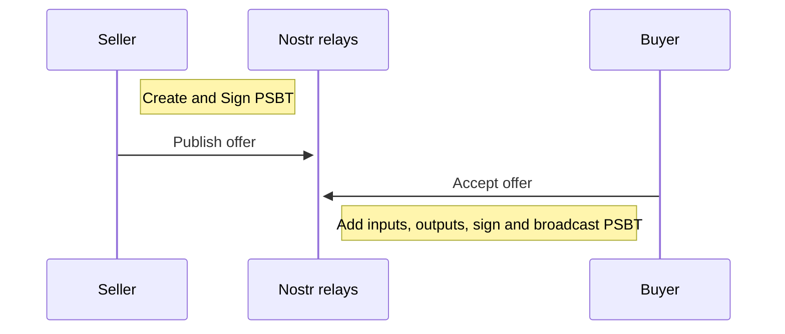

[bitcoin-dev] BIP: Trust minimized swaps using PSBT, SINGLE|ANYONECANPAY and nostr
alicexbt alicexbt at protonmail.com
Fri Mar 3 01:44:03 UTC 2023
Previous message: [bitcoin-dev] Using service bit 24 for utreexo signaling in testnet and signet
Next message: [bitcoin-dev] Bitcoin Contracting Primitives WG 5th Meeting, Tuesday 21 Mar. 18:00 UTC
Messages sorted by: [ date ] [ thread ] [ subject ] [ author ]
Hi Bitcoin Developers,

I have written a BIP that describes the process to swap inscriptions however there can be other use cases for it as well: https://gist.github.com/1440000bytes/a7deeb3f1740bc533a61fbcc1fe58d77

Feel free to share your opinion or feedback to improve the usage of PSBTs in swaps.

    BIP: 2023-ordswap
    Layer: Applications
    Title: Trust minimized swaps using PSBTs
    Author: /dev/fd0
    Status: Draft
    Created: 2023-03-02
    License: Public Domain
  
  
### Introduction

This BIP describes a process for creating offers using PSBTs to swap inscriptions. It was originally shared by [Casey](https://github.com/casey/ord/issues/802). There are two other approaches (`joinpsbts` and coinswap) to swap inscriptions however they degrade the UX and use of SINGLE|ANYONECANPAY works better.

### Specification

[SINGLE|ANYONECANPAY](https://en.bitcoin.it/wiki/Contract#SIGHASH_flags) is used for creating a PSBT by the seller. It is signed and published as offer. Buyer updates the PSBT with appropriate inputs and outputs. Order of inputs and outputs in the PSBT is very important as wrong ordering can burn inscriptions. [Ordinal theory](https://docs.ordinals.com/faq.html?#how-does-ordinal-theory-work) uses an algorithm to determine how satoshis hop from the inputs of a transaction to its outputs.

### Protocol

Sequence diagram:



Seller:

- Create PSBT with inscription UTXO input and a new address with sell amount as output
- Sign PSBT
- Publish PSBT as defined in [NIP](https://github.com/orenyomtov/openordex/blob/main/NIP.md)

Buyer:

- Add new address as output in PSBT to receive inscription
- Create [dummy UTXO](https://i.imgur.com/8Rw3TFX.png) if not available in wallet (Less than 1000 sats)
- Add UTXO to pay seller and dummy UTXO as inputs in PSBT
- Sign and broadcast transaction. 

Example tx: https://mempool.space/signet/tx/ee7032f08ed18113c16ab8759d294c09f57492d8d255b5dbd16326df53bbdcac

This transaction has 3 inputs (dummy, inscription, UTXO used for paying seller) and 4 outputs (inscription, payment, new dummy for future, change)

Note: Openordex creates a dummy UTXO and reuses address if there is no dummy UTXO found for the address entered by buyer. Example: https://mempool.space/signet/tx/388942887f79358a1deba3aae86e97b982a923566b2ef2249eab42288efc5abf

Pseudocode or Implementation (2 functions used by openordex for creating PSBTs)

```js
	
async function generatePSBTListingInscriptionForSale(ordinalOutput, price, paymentAddress) {
    let psbt = new bitcoin.Psbt({ network });

    const [ordinalUtxoTxId, ordinalUtxoVout] = ordinalOutput.split(':')
    const tx = bitcoin.Transaction.fromHex(await getTxHexById(ordinalUtxoTxId))
    for (const output in tx.outs) {
        try { tx.setWitness(output, []) } catch { }
    }

    psbt.addInput({
        hash: ordinalUtxoTxId,
        index: parseInt(ordinalUtxoVout),
        nonWitnessUtxo: tx.toBuffer(),
        // witnessUtxo: tx.outs[ordinalUtxoVout],
        sighashType: bitcoin.Transaction.SIGHASH_SINGLE | bitcoin.Transaction.SIGHASH_ANYONECANPAY,
    });

    psbt.addOutput({
        address: paymentAddress,
        value: price,
    });

    return psbt.toBase64();
}

```

```js

    generatePSBTBuyingInscription = async (payerAddress, receiverAddress, price, paymentUtxos, dummyUtxo) => {
        const psbt = new bitcoin.Psbt({ network });
        let totalValue = 0
        let totalPaymentValue = 0

        // Add dummy utxo input
        const tx = bitcoin.Transaction.fromHex(await getTxHexById(dummyUtxo.txid))
        for (const output in tx.outs) {
            try { tx.setWitness(output, []) } catch { }
        }
        psbt.addInput({
            hash: dummyUtxo.txid,
            index: dummyUtxo.vout,
            nonWitnessUtxo: tx.toBuffer(),
            // witnessUtxo: tx.outs[dummyUtxo.vout],
        });

        // Add inscription output
        psbt.addOutput({
            address: receiverAddress,
            value: dummyUtxo.value + Number(inscription['output value']),
        });

        // Add payer signed input
        psbt.addInput({
            ...sellerSignedPsbt.data.globalMap.unsignedTx.tx.ins[0],
            ...sellerSignedPsbt.data.inputs[0]
        })
        // Add payer output
        psbt.addOutput({
            ...sellerSignedPsbt.data.globalMap.unsignedTx.tx.outs[0],
        })

        // Add payment utxo inputs
        for (const utxo of paymentUtxos) {
            const tx = bitcoin.Transaction.fromHex(await getTxHexById(utxo.txid))
            for (const output in tx.outs) {
                try { tx.setWitness(output, []) } catch { }
            }

            psbt.addInput({
                hash: utxo.txid,
                index: utxo.vout,
                nonWitnessUtxo: tx.toBuffer(),
                // witnessUtxo: tx.outs[utxo.vout],
            });

            totalValue += utxo.value
            totalPaymentValue += utxo.value
        }

        // Create a new dummy utxo output for the next purchase
        psbt.addOutput({
            address: payerAddress,
            value: dummyUtxoValue,
        })

        const fee = calculateFee(psbt.txInputs.length, psbt.txOutputs.length, await recommendedFeeRate)

        const changeValue = totalValue - dummyUtxo.value - price - fee

        if (changeValue < 0) {
            throw `Your wallet address doesn't have enough funds to buy this inscription.
Price:          ${satToBtc(price)} BTC
Fees:       ${satToBtc(fee + dummyUtxoValue)} BTC
You have:   ${satToBtc(totalPaymentValue)} BTC
Required:   ${satToBtc(totalValue - changeValue)} BTC
Missing:     ${satToBtc(-changeValue)} BTC`
        }

        // Change utxo
        psbt.addOutput({
            address: payerAddress,
            value: changeValue,
        });

        return psbt.toBase64();
    }
	
```

Note: Openordex reuses address for change, however this can be avoided.

### Acknowledgements

- Casey Rodarmor
- Oren Yomtov
- Rijndael

/dev/fd0
floppy disk guy


Sent with Proton Mail secure email.
Previous message: [bitcoin-dev] Using service bit 24 for utreexo signaling in testnet and signet
Next message: [bitcoin-dev] Bitcoin Contracting Primitives WG 5th Meeting, Tuesday 21 Mar. 18:00 UTC
Messages sorted by: [ date ] [ thread ] [ subject ] [ author ]
More information about the bitcoin-dev mailing list
